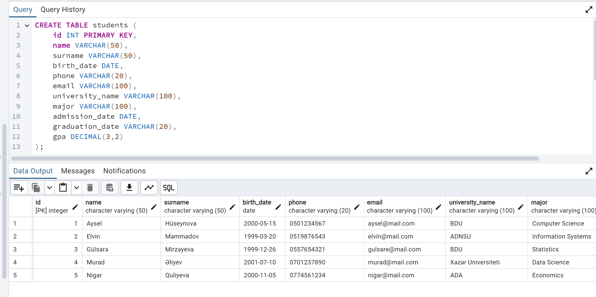
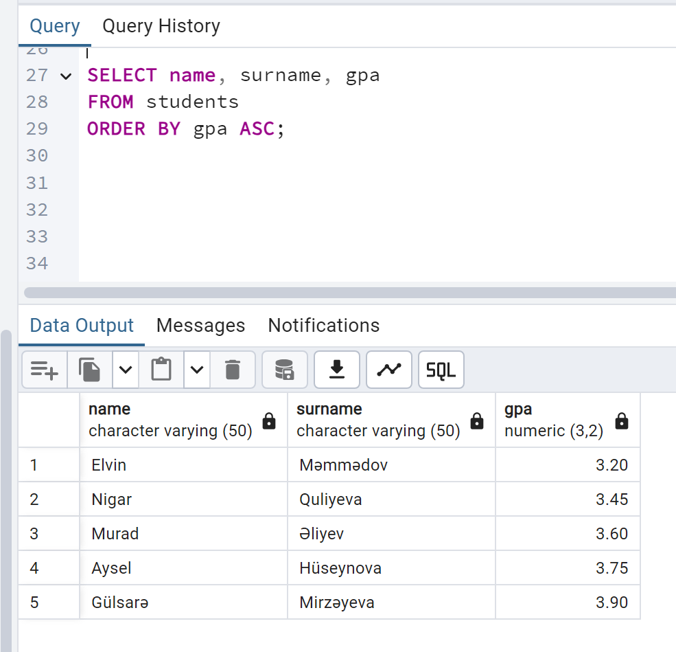
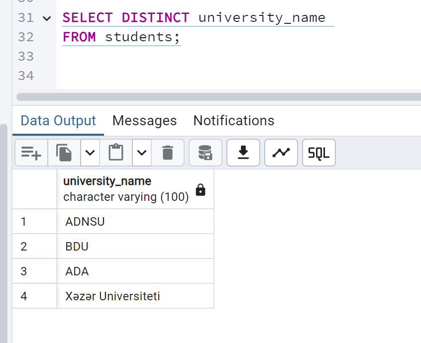
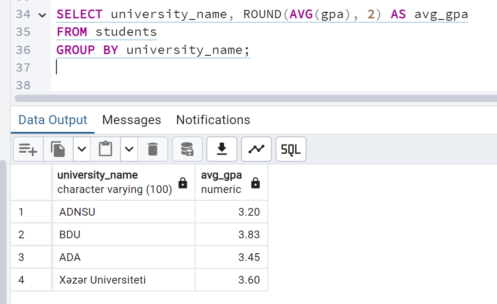
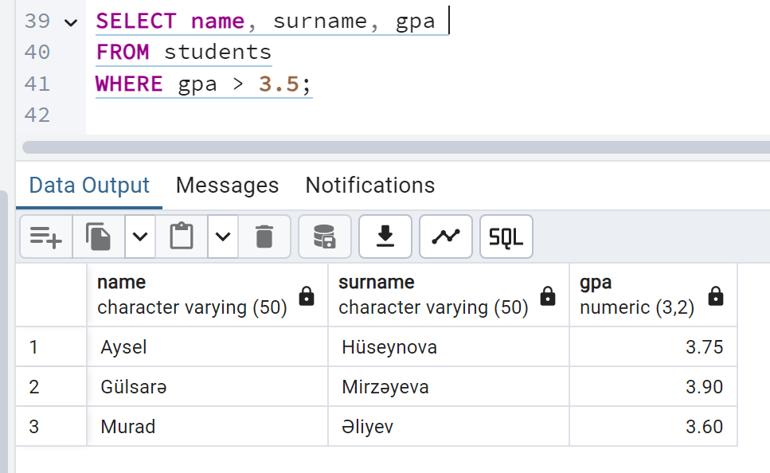
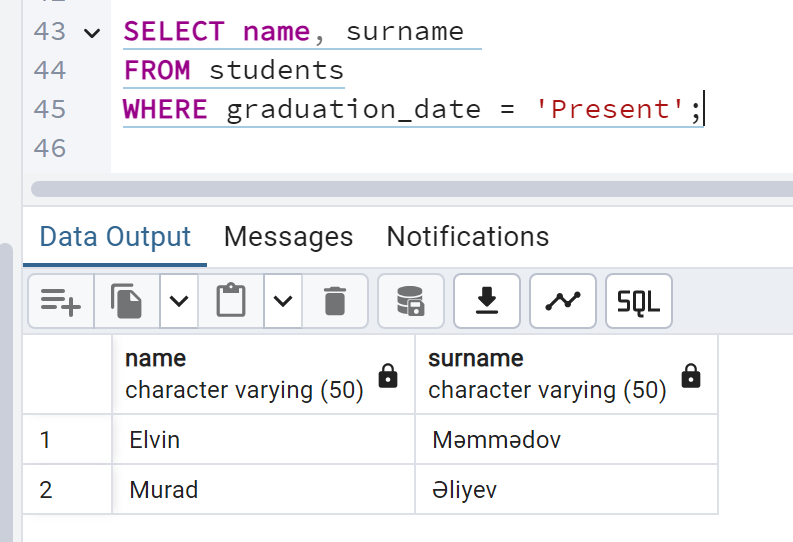
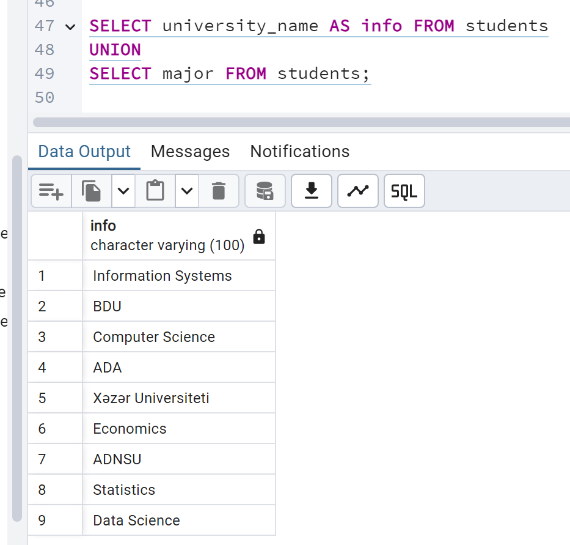
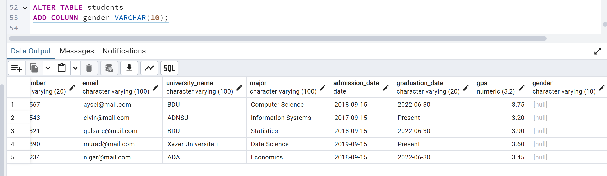
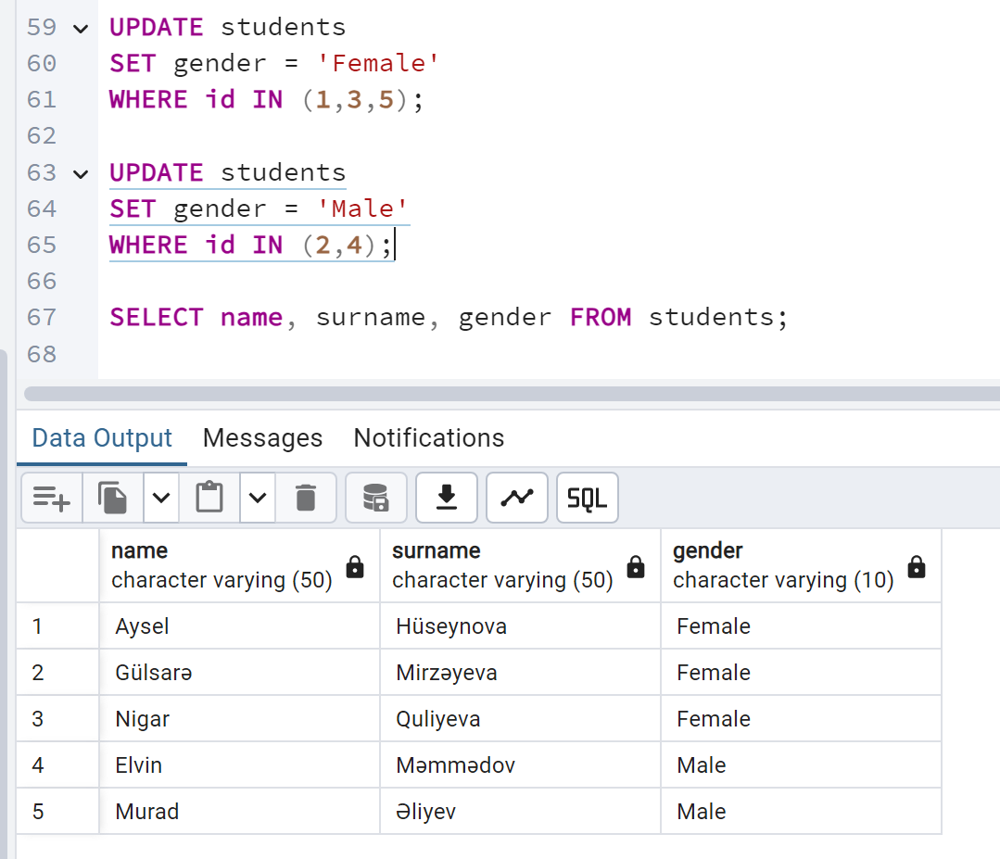
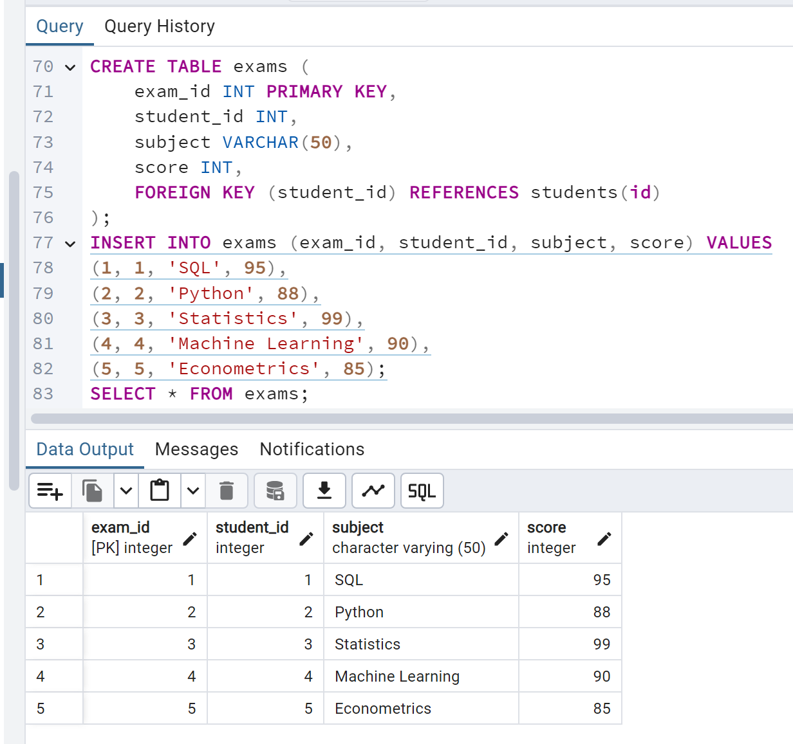

# 🎓 Student Database – PostgreSQL Project

## 📌 Overview
This mini project was developed in **PostgreSQL** to practice **DDL** and **DML** commands.  
It demonstrates how to design a simple student database, insert sample data, and run queries like `SELECT`, `ORDER BY`, `GROUP BY`, and `JOIN`.  
The project also includes a second table (`exams`) with a **foreign key** to show how relational databases connect data.

---

## 🛠 Database Schema
- **students**: stores student details  
  (id, name, surname, birth date, phone number, email, university name, major, admission date, graduation date, GPA, gender).  
- **exams**: stores exam results  
  (exam_id, student_id, subject, score) → connected to `students` with a **foreign key**.  

---

## 📂 Files
- `schema.sql` → table creation (students & exams)  
- `insert_data.sql` → sample data for students and exams  
- `queries.sql` → SQL practice queries (SELECT, ORDER BY, GROUP BY, UNION, JOIN, etc.)  
- `screenshots/` → screenshots of query results  

---

## 📊 Example Queries
```sql
-- Average GPA by university
SELECT university_name, ROUND(AVG(gpa), 2) AS avg_gpa
FROM students
GROUP BY university_name;

-- Students with their exam results
SELECT s.name, s.surname, e.subject, e.score
FROM students s
JOIN exams e ON s.id = e.student_id;
```

## 📸 Results & Explanations

### 1️⃣ Students Table
  
We created the students table with personal and academic details.  
👉 In real environments, this forms the foundation of a student information system (SIS).  

---

### 2️⃣ Order by GPA
  
Query to list students ordered by GPA in ascending order.  
👉 Useful for ranking students or generating merit lists.  

---

### 3️⃣ Distinct Universities
  
Extracted unique university names from the dataset.  
👉 Prevents duplicates and helps generate clean reports.  

---

### 4️⃣ Average GPA by University
  
Calculated the average GPA for each university.  
👉 Important for institutional performance analysis.  

---

### 5️⃣ Students with GPA Above 3.5
  
Filtered students whose GPA is higher than 3.5.  
👉 Used for scholarship eligibility checks or honors programs.  

---

### 6️⃣ Ongoing Students
  
Selected students whose graduation date is marked as "Present".  
👉 Represents active students still enrolled at the university.  


### 7️⃣ Union Example
  
We combined `university_name` and `major` into one result set using **UNION**.  
👉 Useful for merging data with similar structures from different sources.


### 8️⃣ Adding & Updating Gender
  
We added a new **gender** column to the students table.  
👉 Demonstrates schema evolution (adapting tables to new requirements).  

  
Then we updated the gender values for each student.  
👉 Shows how missing data can be filled and maintained in practice.


Created a second table with exam results and linked it to students via a foreign key.
👉 Demonstrates relational database design (1-to-many relationship).

### 🔟 Exams Table
  
We created the **exams** table with exam results and linked it to students using a **foreign key**.  
👉 Demonstrates relational database design (1-to-many relationship).  
👉 In real-world systems, this allows storing multiple exam results for each student.


👩‍💻 About Me

I'm Gülsarə Mirzəyeva, transitioning into the field of Data Analytics & Data Science.
I create projects like this one to strengthen my SQL, database design, and analytical skills, while building a portfolio that reflects real-world use cases.
📫 LinkedIn

📧 Email: mirzayevagulsare@gmail.com
